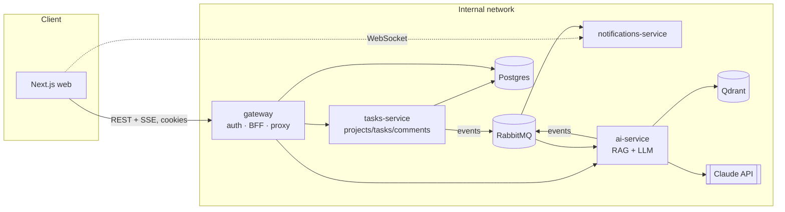

# TaskFlow AI

An AI-native project & task management SaaS built as a microservices reference
architecture: **Next.js + NestJS + TypeScript**, event-driven services over
RabbitMQ, a real RAG pipeline over Qdrant, Docker for local dev, and
Kubernetes manifests for deployment.

It's a working skeleton, not a toy — auth, CRUD, streaming AI chat and
real-time notifications all actually run end-to-end via `docker compose up`.

## What it does

- Users create **projects**, add **tasks** and **comments**.
- Every task/comment is embedded locally and indexed into **Qdrant**.
- An **AI assistant** answers questions about a project ("what's blocking us
  right now?") using retrieval-augmented generation over that index, streamed
  token-by-token from Claude.
- The assistant can also turn a goal into a list of **suggested subtasks**.
- Task/comment/AI events are published to **RabbitMQ** and fanned out to a
  **live activity feed** over WebSocket.

## Architecture



- **gateway** is the only service exposed publicly. It owns auth (JWT in
  httpOnly cookies) and reverse-proxies REST + the chat SSE stream to the
  internal services, forwarding the caller's user id via a trusted header.
- **tasks-service** owns projects/tasks/comments (Postgres via Prisma) and
  publishes domain events whenever something changes.
- **ai-service** is a hybrid HTTP + RabbitMQ-consumer app: it indexes
  incoming task/comment events into Qdrant (local embeddings via
  transformers.js — no extra API key needed) and serves the chat/subtask
  endpoints backed by Claude.
- **notifications-service** bridges RabbitMQ events to connected browsers
  over Socket.IO.
- Each service owns its own database/schema (`authdb`, `tasksdb` on one
  shared Postgres instance for the demo — split into separate instances for
  real workloads).

## Stack

| Layer            | Choice                                                        |
| ----------------- | -------------------------------------------------------------- |
| Frontend          | Next.js 15 (App Router), React 19, TanStack Query, Tailwind    |
| Backend           | NestJS 10, TypeScript everywhere, Zod-validated shared DTOs    |
| Data              | PostgreSQL + Prisma, Redis                                     |
| Messaging         | RabbitMQ (`@nestjs/microservices`)                              |
| AI / RAG          | Claude (`@anthropic-ai/sdk`), Qdrant, transformers.js embeddings |
| Realtime          | Socket.IO                                                       |
| Monorepo          | Turborepo + pnpm workspaces                                     |
| Containers        | Docker (multi-stage, `turbo prune` per app)                     |
| Orchestration     | Kubernetes + Kustomize (base + dev/prod overlays), HPA          |
| CI                | GitHub Actions (lint, typecheck, unit + e2e + Playwright, docker build matrix) |
| Testing           | Jest unit tests, Supertest e2e (gateway, tasks-service), Playwright golden paths (web) |
| Observability     | pino structured logging, `/health` on every service             |

## Repo layout

```
apps/
  web/                    Next.js frontend
  gateway/                Auth + BFF + reverse proxy (public entrypoint)
  tasks-service/          Projects/tasks/comments (Prisma + Postgres)
  ai-service/             RAG pipeline + Claude chat/subtask generation
  notifications-service/  RabbitMQ → WebSocket bridge
packages/
  types/                  Shared TS types & Zod schemas (DTOs, events)
infra/
  postgres/               Multi-database init script
  k8s/base/               Kubernetes manifests
  k8s/overlays/{dev,prod} Kustomize overlays
```

## Getting started

```bash
cp .env.example .env
# fill in ANTHROPIC_API_KEY at minimum — everything else has sane local defaults

pnpm install
pnpm docker:up        # builds + starts every service, Postgres, Redis, RabbitMQ, Qdrant

# first boot only — apply Prisma migrations
pnpm --filter @taskflow/gateway prisma:migrate:dev
pnpm --filter @taskflow/tasks-service prisma:migrate:dev
```

Then open:

- **http://localhost:3100** — the app (register an account to start)
- **http://localhost:3000/docs** — gateway Swagger
- **http://localhost:15672** — RabbitMQ management UI
- **http://localhost:6333/dashboard** — Qdrant dashboard

For day-to-day development without Docker, `pnpm dev` runs every app via
Turborepo (point `.env` at `localhost` instead of container hostnames first).

## Testing

```bash
pnpm test                                         # unit tests, no infra needed
pnpm --filter @taskflow/gateway test:e2e          # Supertest, needs Postgres reachable
pnpm --filter @taskflow/tasks-service test:e2e    # Supertest, needs Postgres + RabbitMQ
pnpm --filter web test:e2e                        # Playwright, needs the full compose stack
```

- **Unit tests** mock `PrismaService`/`ClientProxy`/the Anthropic SDK and
  cover the core business logic (auth, projects/tasks/comments, RAG
  indexing/retrieval, LLM response parsing, the RabbitMQ→WebSocket bridge).
- **e2e tests** boot a real Nest app against a real Postgres (and RabbitMQ
  for tasks-service) — run `pnpm docker:up` first, or point the
  `*_DATABASE_URL`/`RABBITMQ_URL` env vars at any reachable instance.
- **Playwright** drives the actual browser against `pnpm docker:up`
  (register → create project → create task → chat with the AI assistant,
  the last one stubbed at the network layer so it doesn't need a live
  `ANTHROPIC_API_KEY`).

All three run in CI (`.github/workflows/ci.yml`) on every push/PR.

## Deploying to Kubernetes

```bash
kubectl apply -k infra/k8s/overlays/dev   # or overlays/prod
```

`infra/k8s/base/secret.yaml` ships with placeholder values — replace them
(ideally via sealed-secrets / your cloud's secret manager, not plaintext in
git) before applying anywhere but a throwaway cluster. The ingress uses
host-based routing (`app.`, `api.`, `realtime.taskflow.local`); note that
`NEXT_PUBLIC_API_URL` / `NEXT_PUBLIC_NOTIFICATIONS_URL` are baked into the
web image at **build time** (Next.js inlines `NEXT_PUBLIC_*` vars), so the
Docker build args must already match whatever hosts you deploy behind.

## Notable design decisions

- **RabbitMQ fan-out**: `@nestjs/microservices`' default RMQ transport gives
  you a single queue with competing consumers, not pub/sub. Since both
  `ai-service` and `notifications-service` need every event independently,
  `tasks-service` publishes to one dedicated queue per subscriber instead of
  routing through a shared exchange — simple and correct for this scale;
  swap for a topic exchange if you add more consumers.
- **`notifications-service` runs as a single replica** — Socket.IO
  connections pin to one pod, so scaling it needs a shared adapter (e.g. the
  Socket.IO Redis adapter) to fan events out across pods. Not wired up here
  to keep the manifest honest about what it actually does.
- **Local embeddings**: RAG indexing/retrieval uses transformers.js
  (`all-MiniLM-L6-v2`) instead of a hosted embeddings API, so the whole
  pipeline needs only one LLM key (Anthropic) rather than two providers.

## Where to go next

The scaffold intentionally stops at "a real, working system" rather than a
finished product. Natural next additions, roughly in the order most teams
reach for them:

- **Observability**: OpenTelemetry traces across the gateway → services →
  RabbitMQ hops, shipped to Grafana/Tempo or a hosted APM; Prometheus +
  Grafana dashboards fed by each service's `/health`/metrics.
- **GitOps**: ArgoCD or Flux watching `infra/k8s`, instead of `kubectl apply`
  by hand; Renovate/Dependabot for dependency PRs.
- **IaC**: Terraform or Pulumi for the actual cluster/managed Postgres/DNS,
  rather than assuming a cluster already exists.
- **Background jobs**: BullMQ (Redis-backed) for anything that shouldn't
  block a request — bulk re-indexing, digest emails.
- **Auth hardening**: OAuth/social login via Auth.js or Clerk if you don't
  want to own password storage; short-lived access tokens are already in
  place, refresh-token rotation is a good next step.
- **API layer**: tRPC is worth considering instead of hand-rolled REST DTOs
  if the frontend and gateway stay in the same monorepo long-term — you'd
  trade the proxy/DTO boilerplate for end-to-end type inference.
- **Product surface**: Storybook for the component library, Stripe for
  billing, PostHog/GrowthBook for analytics and feature flags, Sentry for
  error tracking.
