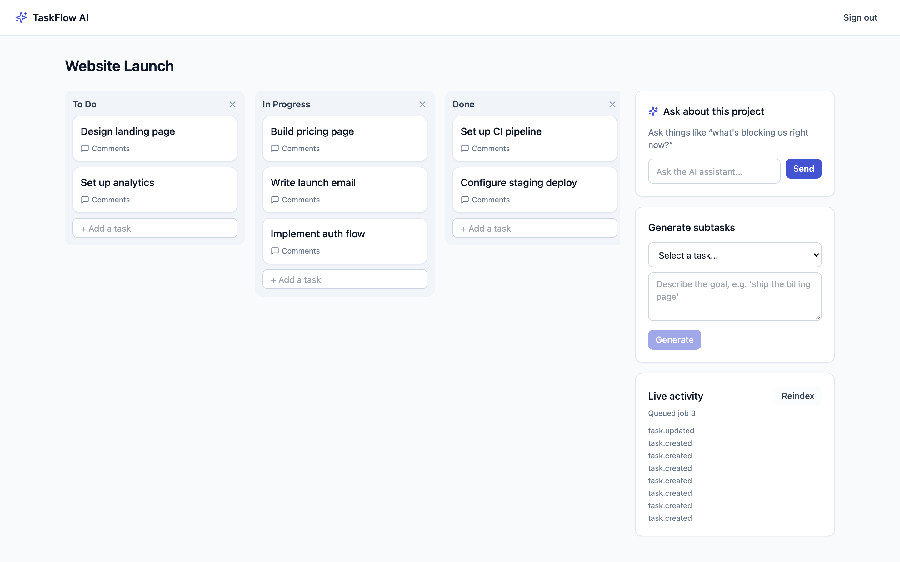
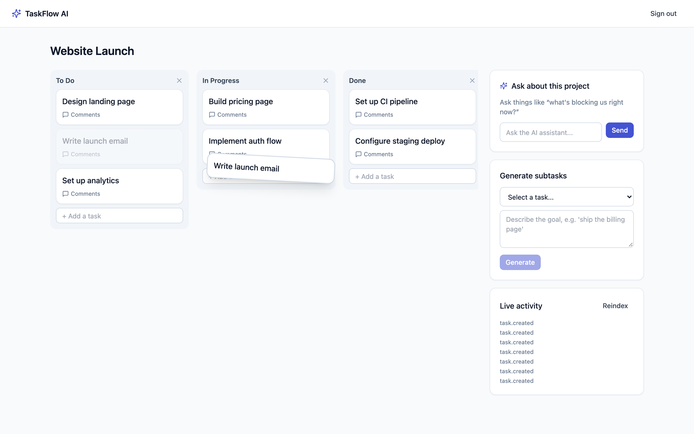
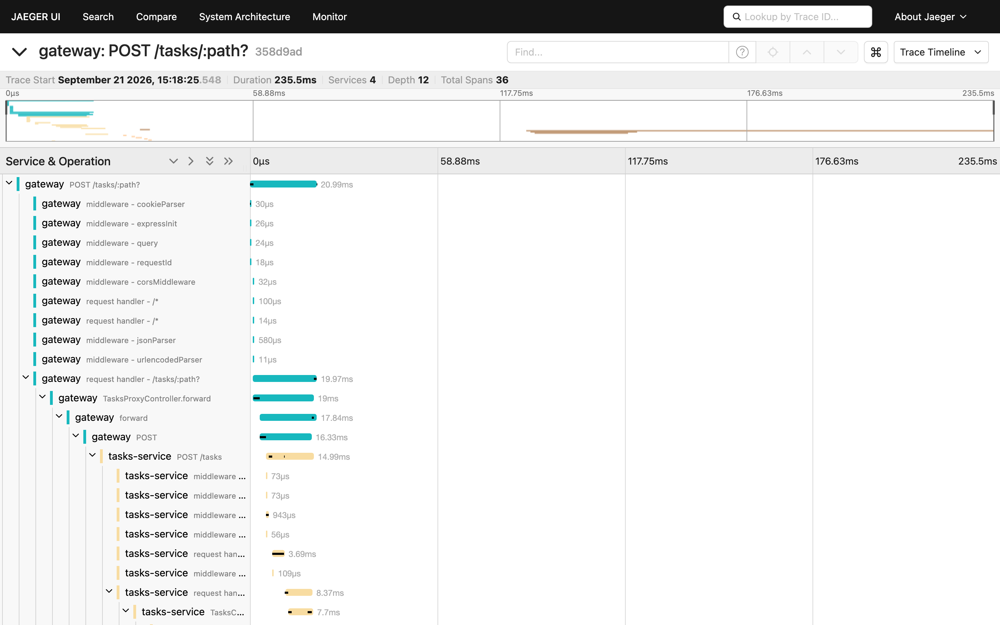
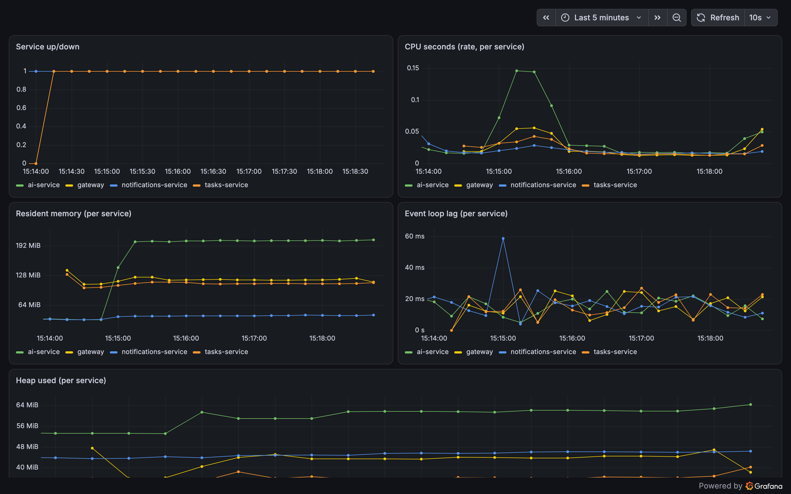
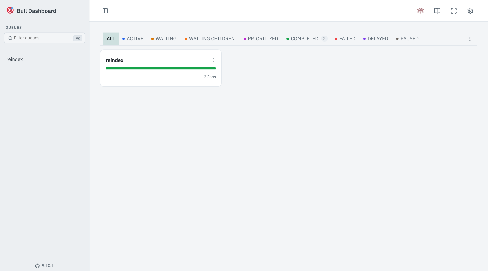
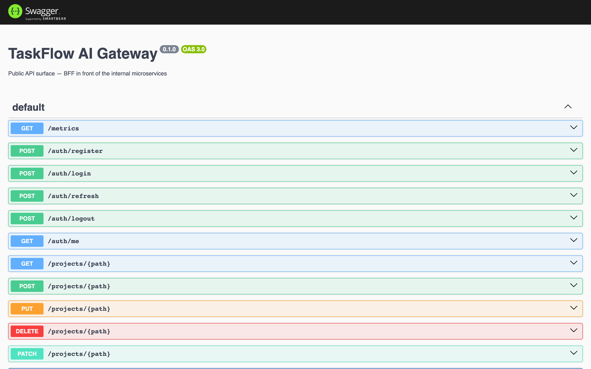
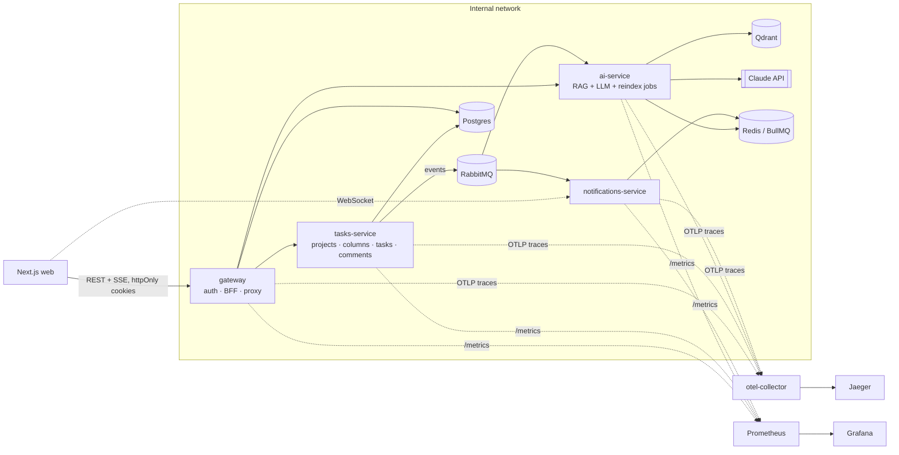

# TaskFlow AI

A Trello-style project & task manager with an AI assistant, built as a
microservices system: **Next.js + NestJS + TypeScript**, event-driven services
over RabbitMQ, a real RAG pipeline over Qdrant, background jobs, full
observability, and Kubernetes manifests. It runs end-to-end with one command.



## What it does

- **Kanban boards.** Every project starts with *To Do / In Progress / Done*;
  add, rename and delete your own columns, and drag cards between them
  (`@dnd-kit`, optimistic updates, fractional ordering so a move touches one row).
- **AI assistant.** Every task and comment is embedded locally
  (transformers.js, no extra API key) and indexed into **Qdrant**. Ask "what's
  blocking us?" and get an answer streamed token-by-token from **Claude**,
  grounded in that project's own data (RAG). It can also break a goal into
  suggested subtasks.
- **Live activity.** Task and comment events flow through **RabbitMQ** to a
  WebSocket feed, so a second browser tab updates in real time.
- **Background jobs.** A BullMQ `reindex` job re-embeds a whole project on
  demand; a repeatable `digest` job summarises recent activity per project.
- **Secure auth.** JWT in httpOnly cookies with **rotating refresh tokens and
  reuse detection**: replaying an already-used refresh token revokes the whole
  token family.

## Screenshots



| Traces (Jaeger) | Metrics (Grafana) |
| --- | --- |
|  |  |

| Job queues (Bull Board) | API docs (Swagger) |
| --- | --- |
|  |  |

## Architecture



- **gateway** is the only public entry point: auth, and a reverse proxy for
  REST plus the chat SSE stream, forwarding the caller's identity in a trusted
  header.
- **tasks-service** owns projects, columns, tasks and comments (Postgres via
  Prisma) and publishes a domain event on every change.
- **ai-service** is a hybrid HTTP + RabbitMQ-consumer app: it indexes events
  into Qdrant, serves chat/subtask endpoints, and runs the reindex queue.
- **notifications-service** bridges RabbitMQ events to browsers over Socket.IO
  and runs the periodic digest job.
- Each service owns its own database (`authdb`, `tasksdb`) — one Postgres
  instance for the demo, separate instances for real workloads.

## Tech stack

| Layer | Choice |
| --- | --- |
| Frontend | Next.js 15 (App Router), React 19, TanStack Query, Tailwind, dnd-kit |
| Backend | NestJS 10, TypeScript, Zod-validated shared types |
| Data | PostgreSQL + Prisma, Redis, Qdrant |
| Messaging | RabbitMQ (`@nestjs/microservices`), BullMQ |
| AI / RAG | Claude (`@anthropic-ai/sdk`), Qdrant, transformers.js embeddings |
| Realtime | Socket.IO |
| Observability | OpenTelemetry → Jaeger, Prometheus + Grafana, pino logs with request-id correlation, Terminus health checks |
| Testing | Jest (unit), Supertest (e2e), Playwright (browser) |
| Monorepo | Turborepo + pnpm workspaces |
| Delivery | Docker (multi-stage, `turbo prune`), Kubernetes + Kustomize, GitHub Actions |

## Quick start

Requirements: Docker Desktop (8 GB+ RAM recommended — it runs 13 containers)
and an [Anthropic API key](https://console.anthropic.com) for the AI features.

```bash
cp .env.example .env
# put your key in ANTHROPIC_API_KEY (everything else has working local defaults)

docker compose up --build      # or: pnpm install && pnpm docker:up
```

Database migrations are applied automatically when the gateway and
tasks-service containers start. Once it is up, open **http://localhost:3100**,
register, and create a project. Everything except the AI answers works without
an API key.

| URL | What |
| --- | --- |
| http://localhost:3100 | The app |
| http://localhost:3000/docs | Gateway Swagger |
| http://localhost:16686 | Jaeger (traces) |
| http://localhost:3300 | Grafana (pre-provisioned dashboard, anonymous viewer) |
| http://localhost:9090 | Prometheus |
| http://localhost:15672 | RabbitMQ UI (`taskflow` / `taskflow`) |
| http://localhost:6333/dashboard | Qdrant |
| http://localhost:3002/admin/queues | Bull Board — `reindex` queue (`admin` / `admin`) |
| http://localhost:3003/admin/queues | Bull Board — `digest` queue (`admin` / `admin`) |

Stop with `docker compose down` (data volumes are kept; add `-v` to wipe them).

### Developing the frontend

The Docker image is a production build, so UI changes need a rebuild. For fast
iteration run everything except the web container in Docker and the frontend
with hot reload:

```bash
docker compose up -d --build
docker compose stop web
pnpm --filter @taskflow/web dev      # http://localhost:3100
```

## Testing

```bash
pnpm test                                          # unit tests, no infrastructure needed
pnpm --filter @taskflow/gateway test:e2e           # Supertest against real Postgres
pnpm --filter @taskflow/tasks-service test:e2e     # Postgres + RabbitMQ
pnpm --filter @taskflow/web test:e2e               # Playwright, needs the compose stack
```

CI (`.github/workflows/ci.yml`) runs lint, typecheck, build, unit and e2e tests
(with Postgres and RabbitMQ service containers), a Playwright job against the
full compose stack, and a Docker build matrix for all five images.

## How the interesting parts work

**Observability.** Every service loads `tracing.js` before anything else
(`node --require`), auto-instrumenting http/express/amqplib/pino and exporting
OTLP to an OpenTelemetry Collector → Jaeger, so one request through the gateway
appears as a single trace across the RabbitMQ hop into the async consumers.
`/metrics` (Node process metrics) feeds Prometheus and a provisioned Grafana
dashboard. Logs share an `x-request-id` the gateway generates and forwards.
`/health` runs real checks (Postgres, Qdrant, RabbitMQ, heap headroom), not just
"the process is up". Tracing is baked into the Docker image, not `pnpm dev`.

**Auth.** Access tokens are short-lived stateless JWTs. Every `/auth/refresh`
rotates the refresh token (tracked in a `RefreshToken` table, linked by
`familyId`); presenting one that was already rotated away is treated as theft
and revokes the entire family. Logout revokes server-side too.

**Kanban data model.** A task's column *is* its status — there is no separate
status enum. Tasks carry a float `order`; dropping a card computes the midpoint
between its new neighbours, so a move updates exactly one row. Deleting a
column that still has tasks is refused (409) rather than cascading.

**RabbitMQ fan-out.** `@nestjs/microservices`' RMQ transport gives one queue
with competing consumers, not pub/sub. Since ai-service and
notifications-service each need every event, tasks-service publishes to one
dedicated queue per subscriber — simple and correct at this scale; swap for a
topic exchange when adding consumers.

## Deploying to Kubernetes

```bash
kubectl apply -k infra/k8s/overlays/dev      # or overlays/prod
```

Manifests cover every service plus the observability stack, with HPAs, probes
and dev/prod Kustomize overlays. `infra/k8s/base/secret.yaml` contains
placeholders — replace them (sealed-secrets / your cloud's secret manager)
before applying anywhere real. `notifications-service` runs as a single replica
on purpose: scaling Socket.IO across pods needs a shared adapter, which is not
wired up here.

## Repository layout

```
apps/
  web/                    Next.js frontend (Kanban board, AI panel)
  gateway/                Auth + BFF + reverse proxy (public entry point)
  tasks-service/          Projects / columns / tasks / comments
  ai-service/             RAG pipeline, Claude chat, reindex jobs
  notifications-service/  RabbitMQ → WebSocket bridge, digest job
packages/
  types/                  Shared TypeScript types & Zod schemas
infra/
  observability/          Collector, Prometheus, Grafana provisioning
  k8s/                    Kubernetes base + dev/prod overlays
  postgres/               Multi-database init script
```

## Roadmap

Deliberately not built yet: GitOps (ArgoCD) and infrastructure-as-code
(Terraform for a local `kind` cluster), OAuth / social login, team
collaboration (a project currently has a single owner), and column
reordering.

## License

[MIT](LICENSE)
